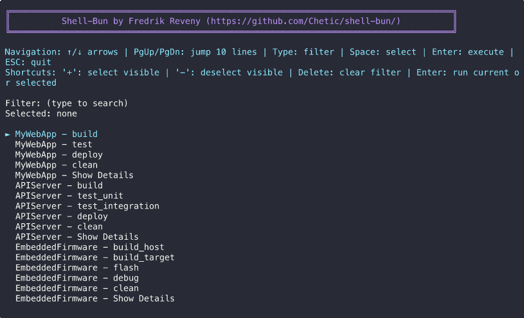

# Shell-Bun

> ☕ **Shell-Bun** combines "build" and "run" - inspired by Swedish fika culture, where gathering for coffee and pastries (🍩🍰) creates the perfect environment for productive collaboration!

An interactive bash script for managing build environments with advanced features and no external dependencies.



## 🚀 Easy Deployment

**Shell-Bun is completely standalone** - it's a single bash script with zero dependencies that can be deployed anywhere instantly:

- **Copy & Run**: Simply copy `shell-bun.sh` to any system with bash > 4, write a simple `shell-bun.cfg` file and run `shell-bun.sh`
- **No Installation Required**: No package managers, no compilation, no setup scripts
- **Portable**: Works on Linux, macOS, Windows (with bash), containers, cloud instances, embedded systems
- **Self-Contained**: Everything needed is in one file - perfect for DevOps, CI/CD, and quick deployments
- **Version Control Friendly**: Add it directly to your project repositories

## Features

- **Completely Generic Actions**: Define any action names you want (build, test, deploy, lint, etc.)
- **Unified Interactive Menu**: Seamlessly combine arrow-key navigation with fuzzy search typing
- **Multi-Selection**: Select multiple commands and execute them in parallel
- **Simple Configuration Format**: Define applications and their commands in a clean INI-style format
- **Working Directory Support**: Specify custom working directories for each application
- **Container Command Support**: Run every configured command through a reusable container wrapper
- **Built-in Status Messages**: Automatic progress logging with emojis and colors
- **Parallel Execution**: Run multiple commands simultaneously with execution summary
- **Automatic Logging**: Commands logged to timestamped files with configurable log directories
- **Interactive Log Viewer**: Browse and view execution logs after everything is completed
- **Color-coded Output**: Beautiful terminal interface with intuitive visual feedback
- **No Dependencies**: Pure bash implementation with no external tools required

## 🤖 CI/CD & Automation Ready

Shell-Bun is designed for both interactive development and automated CI/CD pipelines:

### Non-Interactive Mode
- **Scriptable**: Run specific commands without user interaction
- **Pipeline Friendly**: Proper exit codes (0 = success, 1 = failure)
- **Batch Operations**: Execute multiple actions in sequence
- **Error Handling**: Clear error messages and failure reporting
- **Structured Output**: CI-friendly logging format
- **Parallel Processing**: All actions execute simultaneously for maximum speed
- **Pattern Matching**: Fuzzy matching with wildcards and substrings

### Perfect for DevOps
- **Standardize Builds**: Same build commands across development and CI
- **Version Control**: Check the script into your repository 
- **No Installation**: Works immediately on any CI runner with bash
- **Flexible Configuration**: Different configs for dev, staging, production
- **Debug Support**: Enhanced logging for troubleshooting build issues
- **High Performance**: Parallel execution reduces build times significantly

## Usage

### Running the Script

#### Interactive Mode (Default)
```bash
# Use default config file (shell-bun.cfg)
./shell-bun.sh

# Use custom config file
./shell-bun.sh my-config.txt

# Enable debug mode (creates debug.log file)
./shell-bun.sh --debug
```

#### Non-Interactive Mode (CI/CD)
```bash
# Run multiple actions for an application
./shell-bun.sh --ci APIServer test_unit,deploy_staging
```

**Fuzzy Pattern Matching:**
Shell-Bun supports powerful pattern matching for both applications and actions in CI mode:

```bash
# Wildcard patterns  
./shell-bun.sh --ci "API*" "build*"             # Apps starting with 'API', actions starting with 'build'
```

**CI Mode Features:**
- ✅ **Zero user interaction** - perfect for automated pipelines
- ✅ **Proper exit codes** - exits with 0 on success, 1 on failure
- ✅ **Clear output** - structured logging suitable for CI systems
- ✅ **Error handling** - detailed error messages and failure reporting
- ✅ **Multiple actions** - run several commands in sequence
- ✅ **Flexible execution** - run specific actions or all available actions
- ✅ **Parallel processing** - multiple applications run simultaneously for faster builds
- ✅ **Fuzzy pattern matching** - powerful wildcards and substring matching

### On Windows

Since this is a bash script, you'll need to run it in a bash environment like:
- Git Bash
- WSL (Windows Subsystem for Linux) 
- Cygwin
- MSYS2

Example in Git Bash:
```bash
bash shell-bun.sh
```

## Interactive Controls

### Navigation
- **↑/↓ Arrow Keys**: Navigate through filtered options
- **Page Up/Page Down**: Jump 10 lines up/down for faster navigation
- **Type any character**: Filter commands in real-time (fuzzy search)
- **Backspace**: Remove characters from filter
- **ESC**: Quit the application

### Selection & Execution
- **Space**: Toggle selection of current item for batch execution
- **Enter**: Execute highlighted command OR run all selected commands (if any selected)
- **'+'**: Select all actionable commands
- **'-'**: Clear all selections

## Configuration File Format

The configuration file uses a simple INI-style format:

```ini
# Comments start with #

# Global settings (before any app sections)
log_dir=logs  # Global log directory for all apps
container=docker run --rm my-build-image  # Optional: wrap commands in a container

[ApplicationName]
# Define any action names - completely customizable!
build=command to build the application
test_unit=command to run unit tests
deploy_production=command to deploy to production
clean=command to clean build artifacts
working_dir=optional/path/to/working/directory
log_dir=optional/path/to/override/global/log/dir  # Optional per-app override

[AnotherApp]
build=make all
test=make test
serve=./start_server.sh
clean=make clean
working_dir=~/projects/my-app
```
